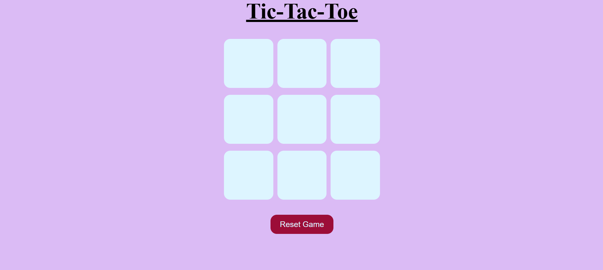
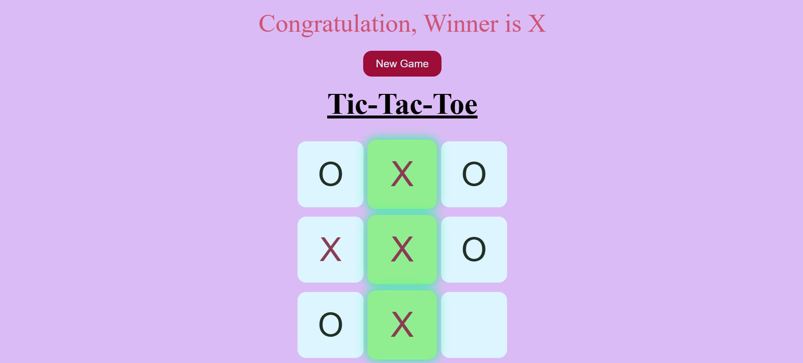
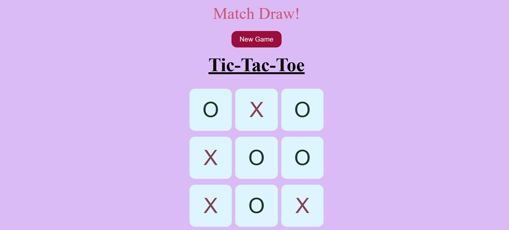

# 🎮 Tic-Tac-Toe Game

A simple and interactive **Tic-Tac-Toe** game built using **HTML, CSS, and JavaScript**. This project was created to practice JavaScript concepts like DOM manipulation, event handling, arrays, loops, functions, and game logic.

---

## 📝 About This Project

This Tic-Tac-Toe game was created as a practice project while revising core frontend technologies including HTML, CSS, and JavaScript.  
The goal of this project was to improve my understanding of DOM manipulation, event handling, and game logic implementation.

---

## 🎨 UI Enhancement

This project also includes a custom favicon for a better browser experience.

---

## 🚀 Features

- 🎯 Two-player gameplay (Player X vs Player O)
- 🏆 Detects the winner
- 🤝 Detects draw (tie) matches
- ✨ Highlights the winning combination
- 🔄 Reset Game button
- 🆕 New Game button
- 🎨 Different colors for X and O
- 📱 Responsive design for desktop and mobile devices
- 🧠 Simple and clean game logic using JavaScript
- ⚡ Fast and lightweight browser game

---

## 🛠️ Technologies Used

- HTML5
- CSS3
- JavaScript (ES6)

---

## 📁 Project Structure

```
Tic-Tac-Toe/
│── index.html
│── style.css
│── app.js
│── README.md
│
└── images/
    ├── home-screen-page.png
    ├── winning-screen-page.png
    ├── logo.png
    └── draw-screen-page.png


```

---

## 🎮 How to Play

1. Player **O** starts the game.
2. Players take turns placing **O** and **X**.
3. The first player to complete a row, column, or diagonal wins.
4. If all 9 boxes are filled without a winner, the game ends in a draw.
5. Click **New Game** to play again.

---

## 📸 Screenshots

### 🏠 Home Screen


### 🏆 Winner Screen


### 🤝 Draw Screen


---

## 📚 Concepts Practiced

- DOM Manipulation
- Event Listeners
- Functions
- Arrays
- Loops
- Conditional Statements
- CSS Flexbox
- Game Logic
- Responsive Design

---

## 🎯 Future Improvements

- 🔊 Sound effects
- 🧠 Play against Computer (AI)
- 📊 Scoreboard
- 🌙 Dark Mode
- ✨ Better animations

---

## 👨‍💻 Author

Made with ❤️ by **Khushi Gupta**

🔗 GitHub: [KhushiGupta13](https://github.com/KhushiGupta13)

---

⭐ If you like this project, don't forget to give it a star!